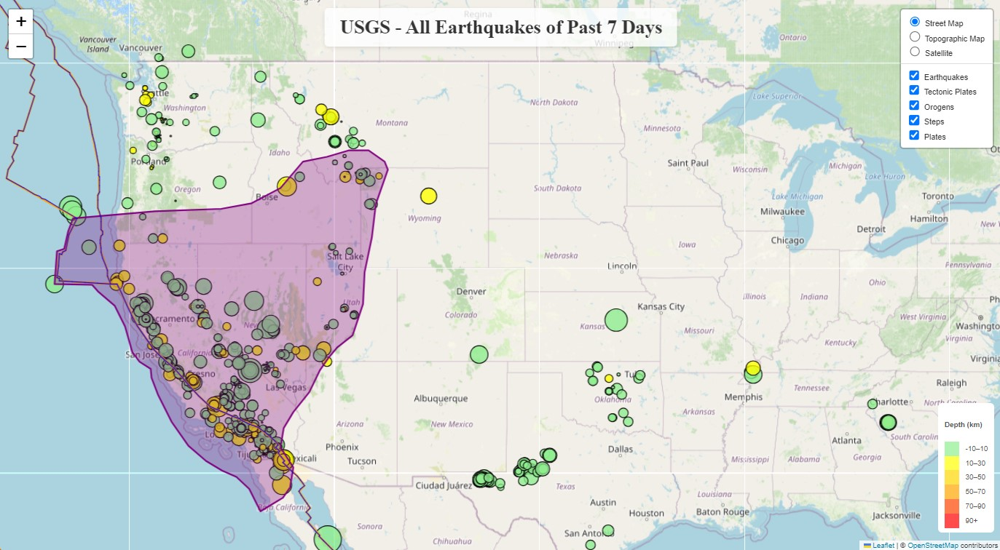

  

# USGS - Earthquake Visualization Project

## Overview
This project visualizes earthquake data from the United States Geological Survey (USGS) using Leaflet.js. The goal is to create an interactive map that plots earthquakes based on their longitude and latitude, providing a visual representation of seismic activity.

## Project Structure
- `Leaflet-challenge/Starter_Code`: Contains the main files for the earthquake visualization
  - `index.html`: The main HTML file
  - `static/js/logic.js`: The JavaScript file containing the map logic
  - `static/css/style.css`: CSS styles for the map
- `Leaflet-challenge/Starter_Code/Tectonic_Plates`: Contains additional files for the tectonic plates visualization

## Features

### Part 1: Earthquake Visualization
- Interactive map using Leaflet.js
- Earthquake data fetched from USGS GeoJSON Feed
- Markers reflect earthquake magnitude (size) and depth (color)
- Popups provide additional information about each earthquake
- Legend explains the depth color scale

### Part 2: Tectonic Plates Visualization (Optional)
- Additional layer showing tectonic plates
- Multiple base maps to choose from
- Layer controls for toggling datasets

## Data Sources
- Earthquake data: [USGS GeoJSON Feed](http://earthquake.usgs.gov/earthquakes/feed/v1.0/geojson.php)
- Visualized earthquake data: [All Earthquakes of Past 7 Days](https://earthquake.usgs.gov/earthquakes/feed/v1.0/summary/all_week.geojson)
- Tectonic plates data: [fraxen/tectonicplates](https://github.com/fraxen/tectonicplates)

## Technologies Used
- Leaflet.js
- D3.js
- HTML/CSS
- JavaScript

## Setup and Usage
1. Clone this repository
2. Open `/Leaflet-challenge/Starter_Code/index.html` in a web browser to view the earthquake visualization

## Legend
- The legend is located in the bottom left corner of the map.
- The legend is interactive and allows you to toggle the visibility of the earthquake data.
- The legend is color-coded to represent the depth of the earthquake.
- The legend is labeled with the minimum and maximum depth of the earthquake.
- Hovering over a legend item will highlight the corresponding earthquakes on the map.

## Additional Information
- The map is centered on the United States.
- The map is zoomed to a level that shows all the earthquake data.
- The map is updated with the latest earthquake data every 10 seconds.

## Additional Features on the Legend
The legend in the image appears to be a layer control panel rather than a traditional legend. Based on this, here are the features it likely provides:

- Basemap Selection: The top section allows users to choose between different basemap styles:
  - Street Map (currently selected)
  - Topographic Map
  - Satellite

- Data Layer Toggles: The bottom section allows users to toggle the visibility of various data layers:
  - Earthquakes
  - Tectonic Plates
  - Orogens
  - Steps
  - Plates

- Interactivity: 
  - Clicking on a checkbox next to a layer name toggles its visibility on the map.
  - The panel is likely collapsible/expandable for a cleaner interface when not in use.

- Visual Hierarchy:
  - Basemap options are presented as radio buttons, ensuring only one can be selected at a time.
  - Data layers use checkboxes, allowing multiple layers to be visible simultaneously.

- Accessibility:
  - The contrast between the white background and dark text enhances readability.
  - The use of checkboxes and radio buttons provides familiar interaction patterns for users.

## Future Improvements
- Add time-based filtering of earthquake data
- Implement clustering for better performance with large datasets
- Create additional data overlays (e.g., population density, fault lines)

## Contributors
Sergei Sergeev - sergei.sergeev.n@gmail.com

## License
This project is licensed under the MIT License - see the (LICENSE) file for details.

## Acknowledgments
- USGS for providing the earthquake data
- [fraxen](https://github.com/fraxen) for the tectonic plates dataset